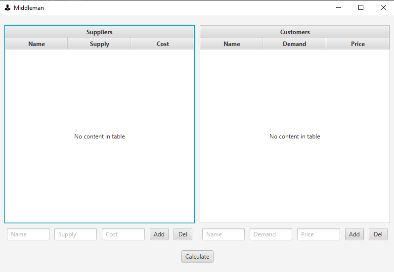
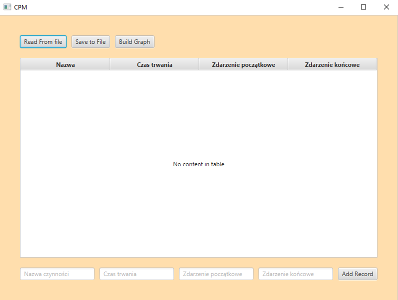

####  **Projekt realizowany w ramach przedmiotu Badania Operacyjne i Logistyka**

# CPM i Zagadnienie pośrednika

Repozytorium zawiera dwie aplikacje napisane w JavaFX rozwiązujące problem:
- Zagadnienie pośrednika (zbilansowane i niezbilansowane)
- Critical Path Method (wyznaczenie ścieżki krytycznej)

## Uruchomienie aplikacji

### Dependencies

Lista zależności znajduje się w pliku `pom.xml`.

### Launch the apps

Aby uruchomić GUI z zagadnieniem pośrednika należy uruchomić plik `MiddlemanApplication.java`

Aby uruchomić GUI z CPM należy uruchomić plik `CPMApplication.java`

## Built With

- [JavaFX](https://openjfx.io/)
- [Lombok](https://projectlombok.org/)

## Authors

- **jeremi1111111** -
  [github](https://github.com/jeremi1111111)
- **curaposterior** - 
  [github](https://github.com/curaposterior)
- **MaksKubiczek** - 
  [github](https://github.com/MaksKubiczek)

## License

This project is licensed under the [MIT License](LICENSE)
